# Art of the Buddha's life

## BRIEF TIMELINE

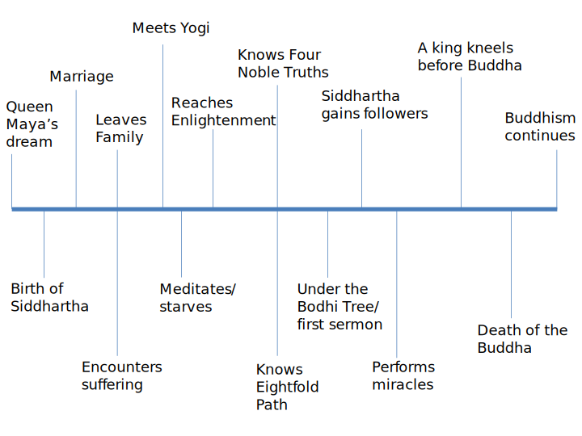

## GRAPHIC & SUMMARY

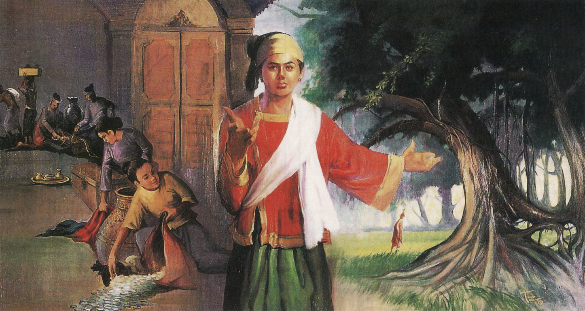

SUMEDHA, the wise man inherited a vast fortune from his parents who left them upon their deaths. Realizing the unsatisfactoriness he gave away his fortune and became an ascetic in the forest. He soon gained mastery in meditation and was well known for his supernormal powers.

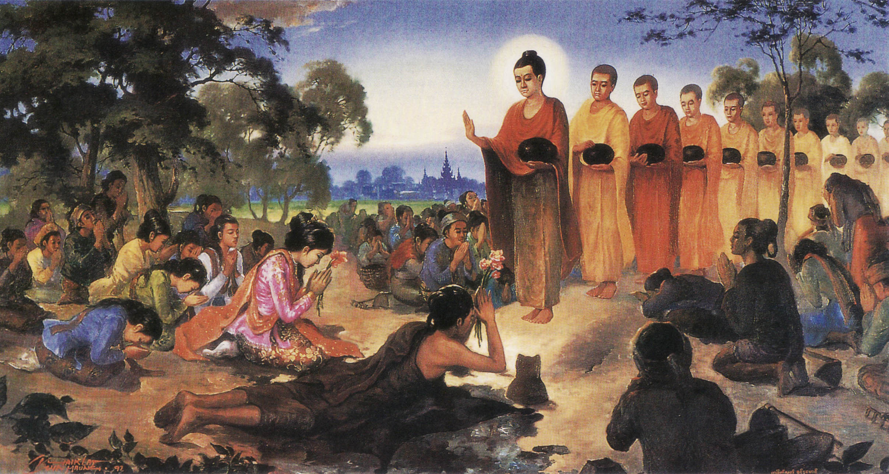

When ascetic Sumedha knew of the coming of Dipankara Buddha to the city of Rammavati, he took part in preparing the road for the Buddha. He was still repairing it when the Buddha arrived but he was determined to complete it by prostrating himself into the muddy hollow, in fulfillment of his vow to become a Buddha. Beside him was a young lady named Sumitta bearing eight stalks of lotus flowers. She gave the Ascetic five stalks and kept for herself three stalks for her own aspiration.  When the Buddha Dipankara saw this, He omnisciently declared the Ascetic Sumedha a future Buddha, while He stated that the aspiring young lady Sumitta would be his constant companion and helpmate.

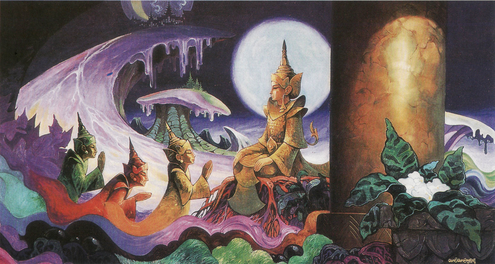

The Devas \(Gods\) imploring the Bodhisatta Santussita Deva \(whose real name was Setaketu\) in Tusita heaven to be reborn on earth to become a Buddha. He accepted their request after viewing the Five Great Considerations \(Panca Maha Vilokana\); which are appropriate time, Island-continent, country, clan and life-span of mother.

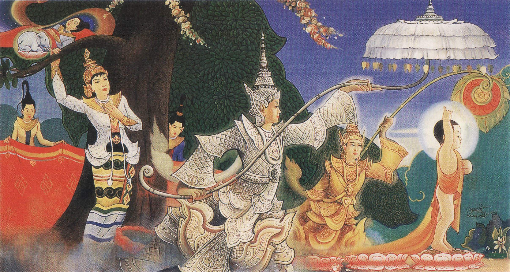

At Lumbini Park in Nepal, on Vesakha Full Moon Day, the newly born Prince walked seven steps on the lotus flowers and pointing to the North said, “AGGOHAM ASMI LOKASSA” meaning “Chief Am I in this world”. The birth of this baby Prince brought great joy to his royal parents, King Suddhodana and Queen Maha Maya as well as all beings!

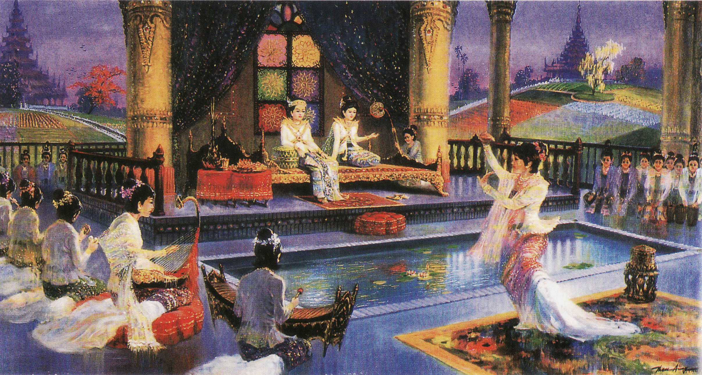

The marriage of Prince Siddhattha and Princess Yasodhara \(whose real name was BaddaCancana \) took place at the Golden Palace which was presented by his father, King Suddhodana. It was a luxurious palace full of comforts of life . The celebration lasted many days.

During his visit to the Royal park, Prince Siddhattha saw the Four Great Signs, namely — an old man, a sick man, a corpse and a serene mendicant. These made the Prince to realize the unsatisfactoriness of life and urged him to ponder deeply about renunciation.

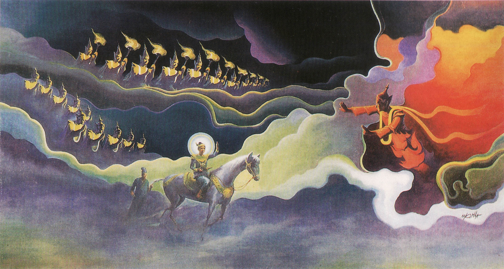

Mara \(the Evil One\), with his host tried without success to prevent Prince Siddhattha from his Great Renunciation at midnight . Prince Siddhattha was riding on Kanthaka his fovourite stallion and followed by Channa his loyal charioteer. Mara said that if the prince did not proceed on his renunciation, he would become a Universal Monarch on the seventh day.

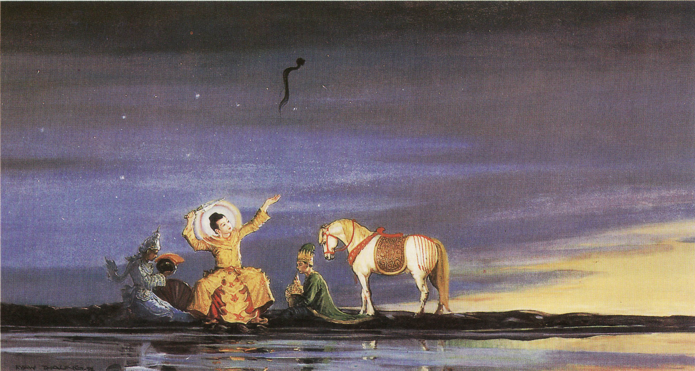

Prince Siddhattha cut off his hair to renounce the worldly life at the bank of the Anoma River. Ghatikara Maha Brahma presented the Monk’s Eight Requisites to Ascetic Siddhattha, who commanded his charioteer Channa to take his royal chattels back to the palace. His hair was received by Sakka, King of Gods and enshirned in CULAMANI CETI \(pagoda\) in his celestial abode in TAVATIMSA. Similarly, Ghatikara Maha Brahma bore his princely clothes to his higher celestial abode, Akanittha and enshrined them in the pagoda known as DUSSA CETI.

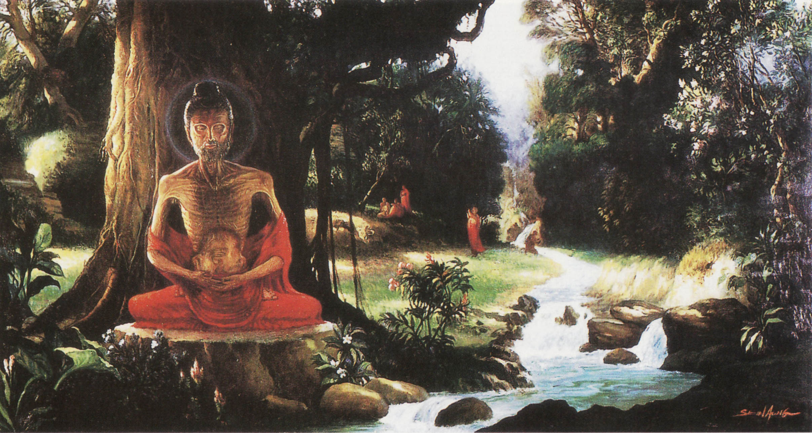

The ascetic Bodhisatta spent six years practising austerity and meditation with steadfastness as well as earnestness, prior to his attainment. Even though he was reduced to a mere skeleton, he did not give up practising.

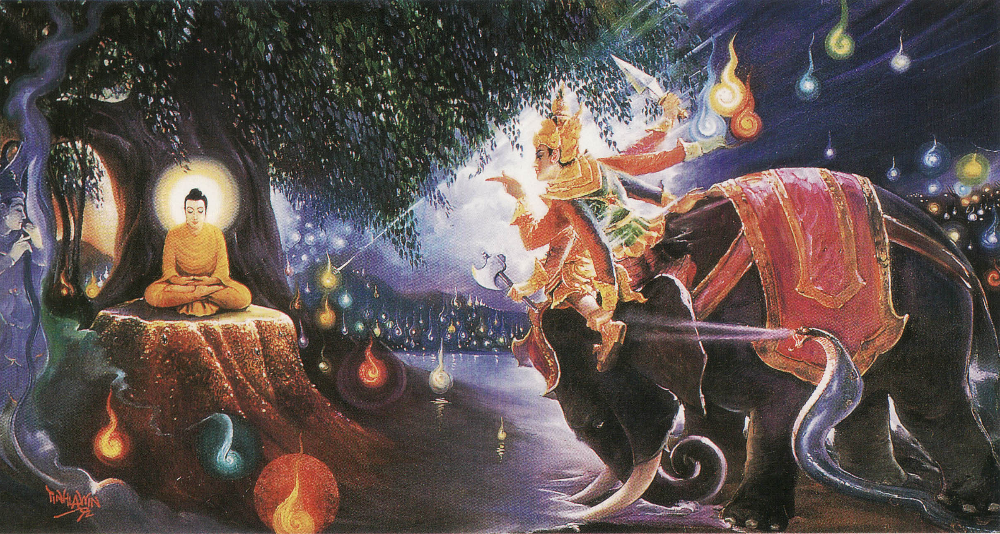

The Bodhisatta was sitting on a Golden Throne under a Bodhi tree and being challenged by Mara \(the Evil One\) riding on the ferocious elephant Girimekhala. Mara with host tried to capture the Golen Throne just before the Bodhistta’s Enlightenment.

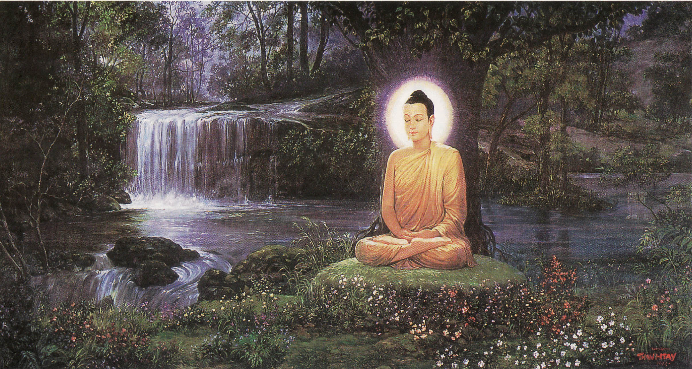

On Vesakha Full Moon day, Bodhisatta Siddhattha seated under a Bodhi tree at Gaya, attained Supreme Enlightement. On the first watch of the night he gained knowledge by which He remembered past lives. On the second watch of the night he was able to see into the future including the birth and death of other beings. On the third watch of the night, He destroyed all defilements and became a Fully Enlightened One \(Samma-Sambuddha\).

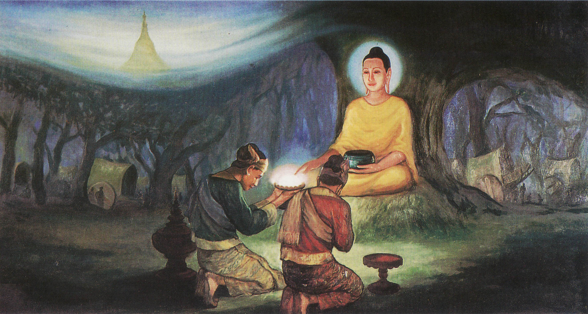

It was in the final week \(7th week\) after his Enlightenment, when the two merchant brothers Tapussa and Bhallika from Ukkalapa passed by the spot and saw the Buddha. They offered the Buddha their own provision; then the Buddha gave eight strands of hairs from His head for them to worship as sacred objects of veneration.The hair relics are now enshrined in the Shwedagon Pagoda in Yangon, Myanmar.

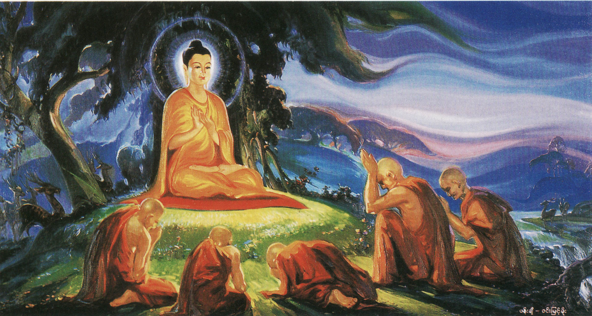

At the Deer Park at Varanasi, the Buddha met the five ascetics, Kondanna, Vappa, Bhaddiya, Mahanama and Assaji all of whom He had known before .He delivered His first sermon to them. It is called the Dhammacakkapavattana Sutta which sets the wheel of the Dhamma in motion. The ascetic Kondanna who was at His childhood Name-giving Ceremony became the first to see light in the Dhamma and attained Sotapanna, the first stage of Sainhood. Later, all attained Arahantship after hearing the Anatalakkhana Sutta \(the Discourse which deals with No-Self\)

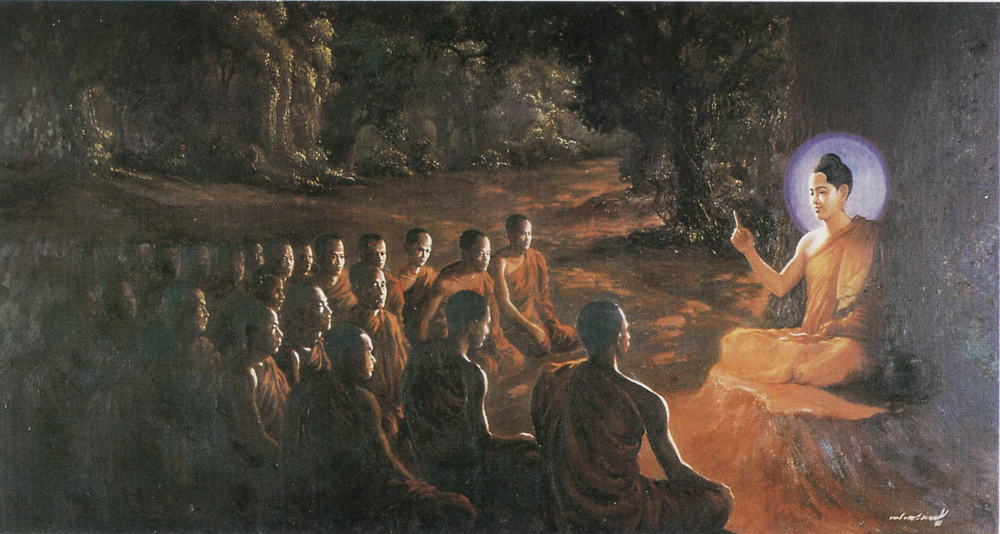

The Buddha exhorted His first sixty Arahant disciples to go forth in different directions to preach the Doctrine, using these famous words: – “Go ye, 0 bhikkhus and wander forth for the gain of many, for the welfare of the many, in compassion for the world, for the good, for the gain, for the welfare of the Devas \(Gods\) and men . Proclaim ye, 0 Bhikkhus! The Doctrine that is glorious and preach ye a life of holiness, perfect and pure!”

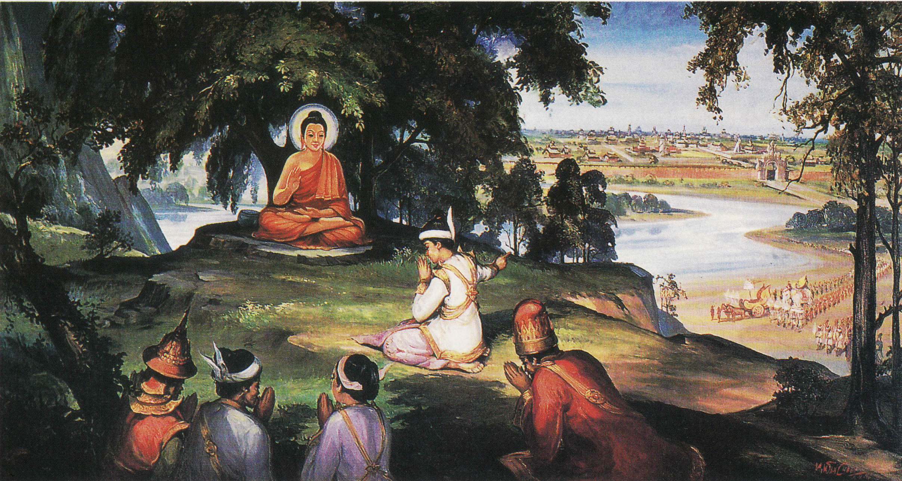

When the Bodhisatta visited Rajagaha, the capital of Magadha, King Bimbisara offered his Kingdom to the Bodhisatta. But He did not accept it because of the worldly pleasures. After listening to the preaching of Buddha, the King attained the first stage of Sainthood \(Sotapanna\). He then dedicated his Royal park known as Veluvana \(Bamboo Grove\) to the Buddha and His disciples.

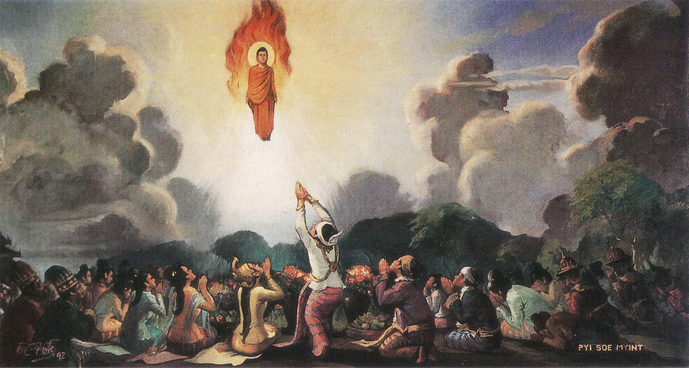

The Buddha performed the Twin Miracles of emitting fire and water simultaneously from His body, to subdue the pride of his older relatives who had erroneously thought that the Buddha being the younger would have to show respects to them.

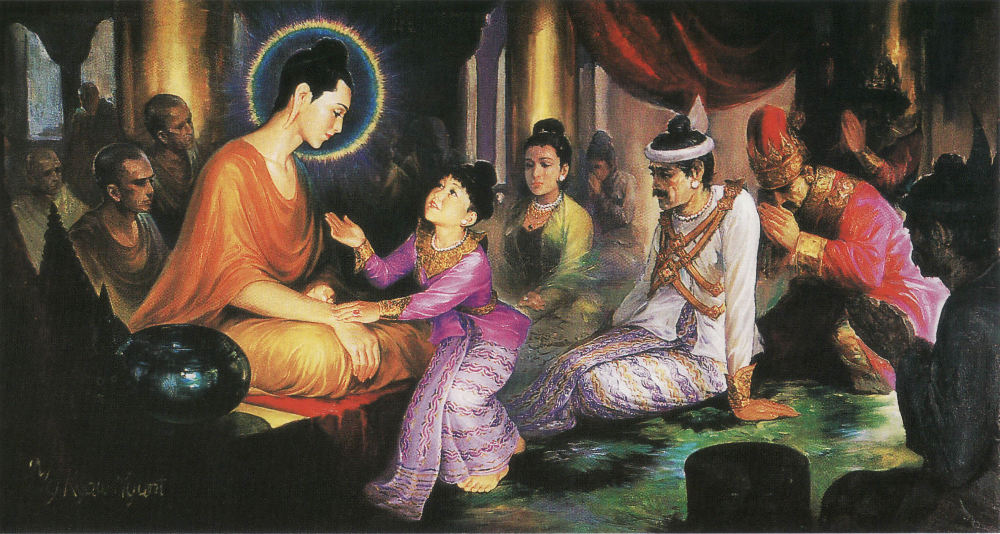

On the seventh day after his arrival in Kapilavatthu, Princess Yasodhara dressed up Prince Rahula and pointing to the Buddha said, “Behold, son, the great Ascetic of majestic appearance is your father. Go up to him and ask for your inheritance!” As advised by his mother, young Rahula came to His presence and asked for his inheritance. Instead, the Buddha told Venerable Sariputta to ordain Prince Rahula , giving him a spiritual inheritance better than the one he asked for.

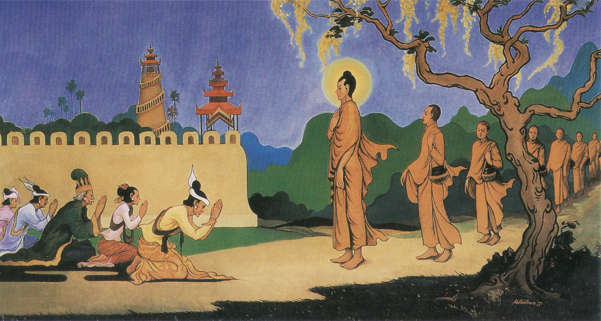

During a subsequent visit to Rajagaha City, the Buddha went for alms-round in the company of His Chief Disciples and other monks. Along the way King Bimbisara and his royal family paid repects to the Buddha and His disciples.

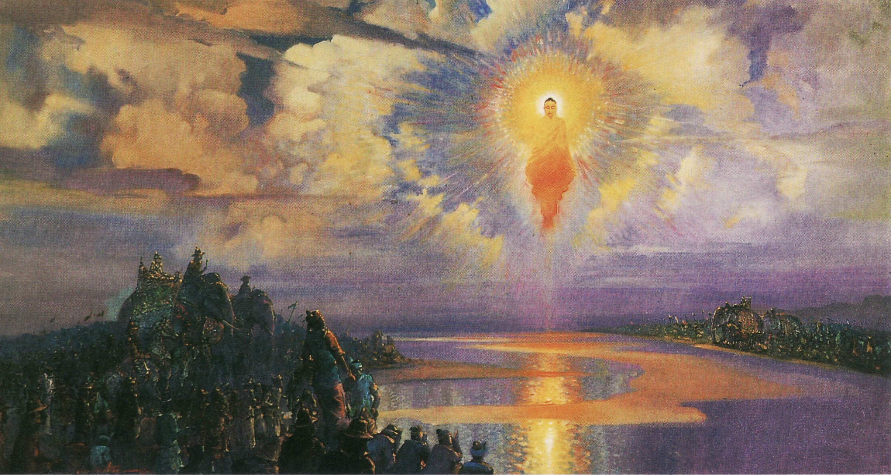

The Buddha delivering a sermon of peace to two powerful warning armies of Kapilavatthu and Koliya at the opposite banks of the Rohini river before the two countries started fighting for the water supply of the river, for pastoral use.

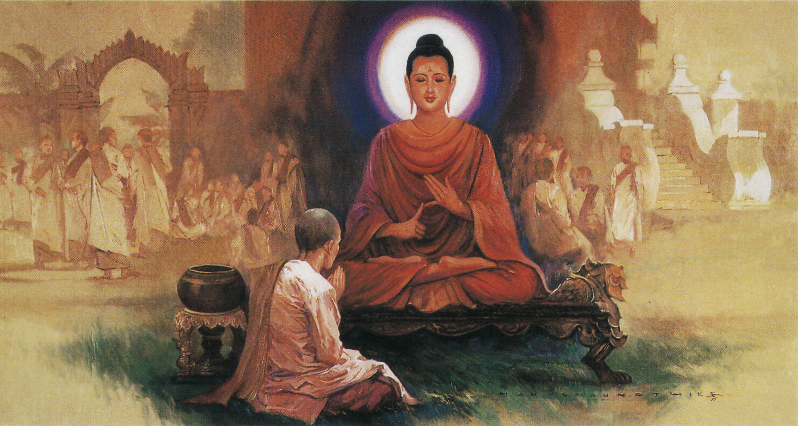

The Order of Nuns \(Bhikkhuni Sasana\) was founded in the fifth year of the Buddha’s Enlightenment. After the death of King Suddhodana, Maha Pajapati Gotami , who was His former foster mother desirous of joining the Order ,approached the Buddha who was then, residing at Kapilavathu and begged permission for women to be admitted into the Order. After hearing and turning down their pleas, Buddha returned to Vesali for the Rains Retreat . Undaunted by the rebuff, Maha Pajapati Gotami cut off her hair and wearing yellow garments went on foot to Vesali, accompanied by many other Sakyan ladies. They stood outside the porch of the Pinnacled Great Hall in Mahayana where the Buddha was residing. Interceded by Venerable Ananda , the Buddha finally consented to establish the Bhikkhuni Sasana when Maha Pajapati Gotami and other Sakyan ladies agreed to observe the Eight Disciplinary Rules for nuns. Henceforth Maha Pajapati Gotami and other Sakyan ladies were admitted into the Order.  
Later, the Nuns Khema and Uppalavanna were appointed the two Chief female Disciples; as were Sariputta and Moggalana the two Chief Male Disciples.

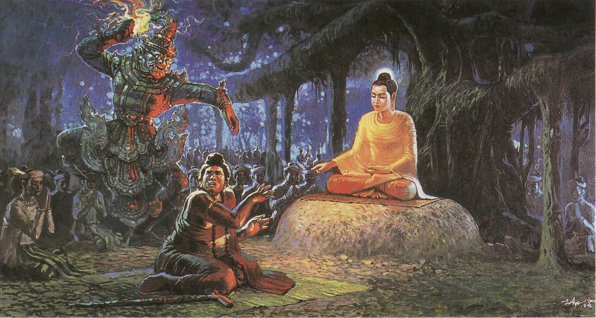

After losing in lively debate, the haughty hermit Saccaka refused to answer accordingly when the Buddha asked a question. Only when he was threatened to be beaten up by a celestial demon for arrogance, only then did he finally realize his own folly and listened to the Buddha’s preaching meekly. This wholesome action of his would augur well for his future.

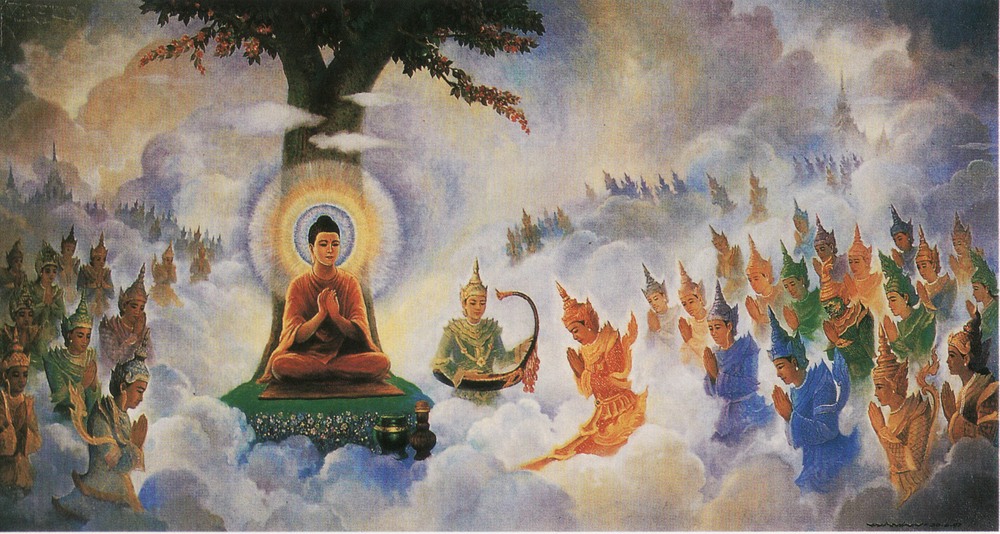

On the seventh year after His Enlightenment, the Buddha preached the Abhidhamma \(higher Doctrine\) in Tavatimsa Heaven. As a fulfillment of gratitude to his former mother, now a Santussita deva, the Buddha then delivered a sermon on the Higher Doctrine to thousands of Devas \(Gods\) and Brahmas \(higher celestial beings\) who attained the various stages of Noble Sainthood.

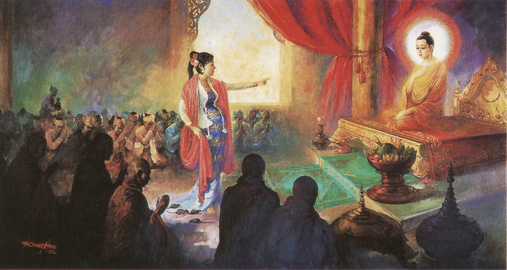

The non Buddhist sectarians grudgingly wanted to ruin the Buddha’s reputation. They told Cinca Manvika , a beautiful girl to falsely accuse the Buddha for her shamed, pregnancy in a big and august assembly. King of Devas \(Gods\) dispatched some Deities disguised as mice to gnaw through the strings holding a block of wood under her garment. Her plot was exposed when the wood fell on her feet. When the people saw that, they threw stones and chased her away. As she was walking away, the earth spilt open and a flame sprang up to envelop and drag her down to Avici \(deepest and worst\) Hell.

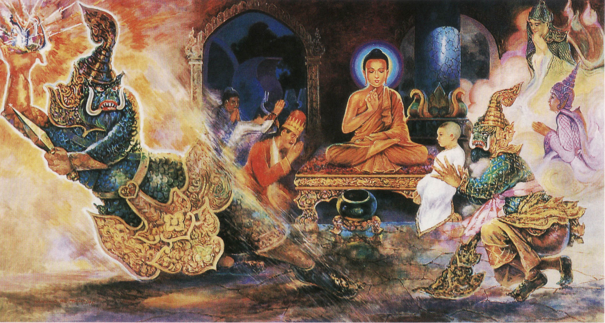

On the sixteenth year of His Enlightment, the Buddha tamed the carnivorous Demon King , Alavaka who feasted on human flesh, to give up his habit on devouring at least one human being everyday. After hearing the Buddha’s Teaching, he henceforth gave up his habit, thus sparing the small child offered to him as food on that day.

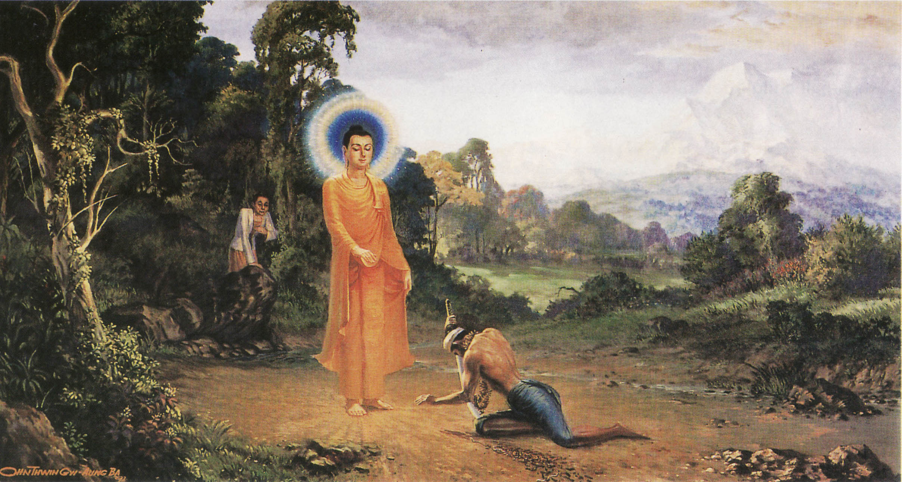

There was a young harmless student at TAKKASILA University called Ahimsa. His jealous fellow students poisoned the mind of their teacher against him. As a result the teacher asked Ahimsa for a garland of one thousand right index fingers as tuition fee. Eager to discharge his obligation, he went into the Jalini forest in Kosala and started to waylay the passing travellers to collect an index finger from the right hand of each victim. The garland was almost completed except for one more single finger. Ahimsa decided to kill even his own mother for the sake of completing the one thousandth finger in the garland. However, Ahimsa was intercepted by the Compassionate Buddha who came to his aid. After listening to His preaching and being convinced, Ahimsa now known as Angulimala \(garland of fingers \) joined the Sangha and became a Bhikkhu \(monk\) . The Angulimala Sutta, a discourse ascribed to this Thera \(elder/monk\) and connected to this event, is well-known in Buddhist countries and often used by pregnant ladies in travail for easy and safe delivery.

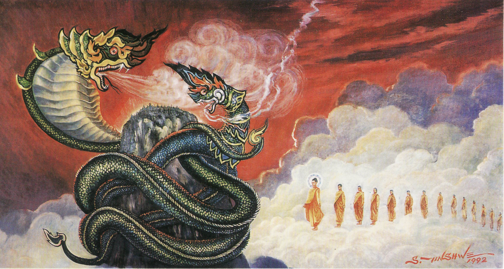

Once the Buddha and His Disciples went to Lake Anotatta passing by the mansion of Nandopananda the dragon king who was enjoying himself with his retinue. Angry at the apparent trespassing, Nandopananda coiled itself seven times round Mount Meru, covered the summit with its hood and spewing hot poisonous smoke to prevent the Buddha and his disciples from reaching lake Anotatta. Thereupon Maha Moggalana, \(the second Chief Disciple\) at once transformed himself into a dragon and likewise coiled round the mountain, crushing Nandopananda. Watched by the Buddha and His disciples, Maha Moggalana too began spewing hot poisonous smoke which greatly distressed Nandopananda who soon lost the challenge and upon realization of his folly, sought refuge in the Triple Gem of Buddhism.

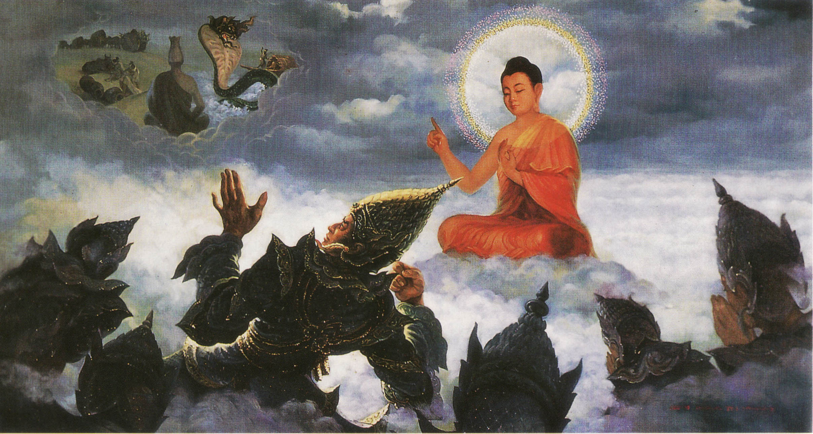

Baka Brahma, who was bitten by the snake of tenacious heresay \(in believing that the Brahma Loka is the best and everlasting world in existence\) , was duly defeated by the Buddha in a mutual contest to show power. On hearing the Buddha’s profound expounding of the Dhamma \(Buddhist Doctrine\), he became enlightened along with many other Brahmas \(higher celestial beings\).

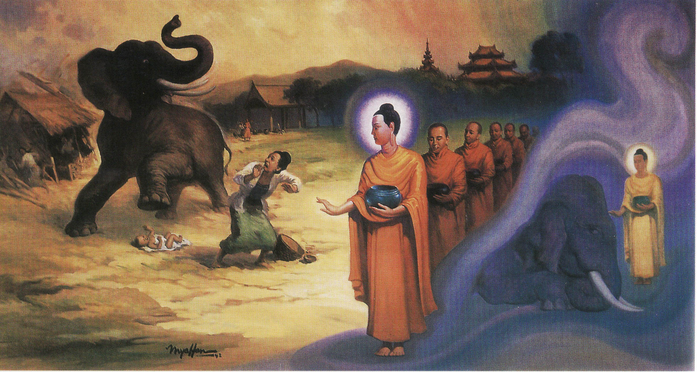

When the Buddha was on his way to the city of Rajagaha, Devadatta ordered the release of the fierce elephant, Nalagiri, to harm Him. As the elephant charged towards the Buddha, everyone ran away leaving a mother and her baby on the ground. The Buddha radiated His infinite Compassion to calm and subdued the elephant before it could trample the helpless baby.

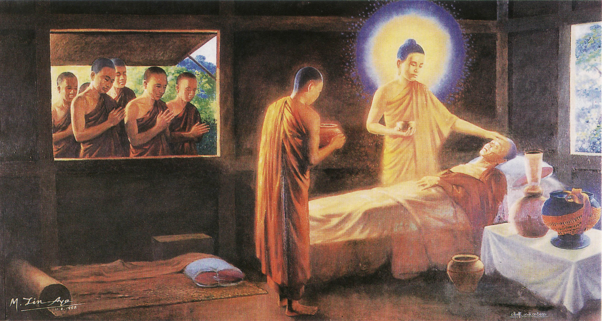

The Buddha taking care of a sick monk, named Tissa who had been neglected by his unthoughtful fellow monks. By so doing, the Buddha wanted to foster mutual care and welfare amongst the Bhikkhus as well as others.

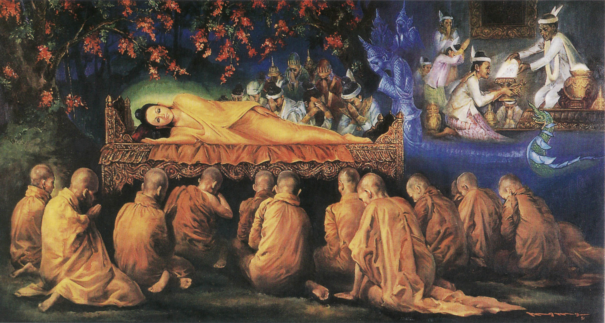

1.  The Buddha at Kusinara laid himself between two Sal trees with his head to the North, determined not to rise again. He them delivered his last admonition, “Behold, 0 Disciples! I exhort you ! Subject to change are all component things! Strive on with Diligence !” before He entered Maha parinibbana \(attainment of Final Emancipation\).  
2.  Dona , the Brahman divided the Buddha’s relics into eight equal portions and distributed each of them to the Rulers of the eight countries. Then Dona decided that the golden container be kept for himself as an object of respectful veneration.

