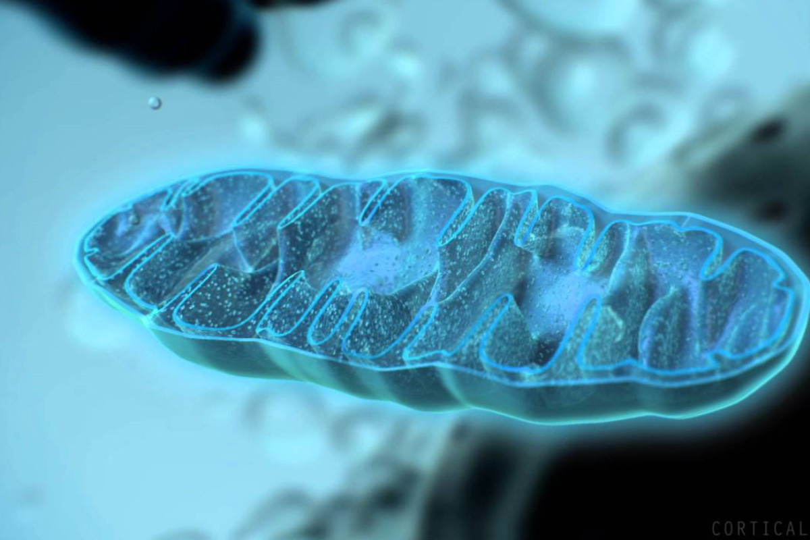

# Body's decentralized power plant

## 3D ANIMATION



## RESOURCES

[https://www.ncbi.nlm.nih.gov/books/NBK9896/](https://www.ncbi.nlm.nih.gov/books/NBK9896/)  
[https://www.sciencedirect.com/science/article/pii/S0005272810000058?via%3Dihub](https://www.sciencedirect.com/science/article/pii/S0005272810000058?via%3Dihub)  

