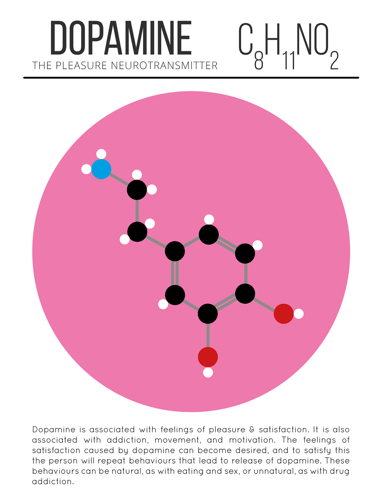

# Brain drugs

These chemical messengers can affect a wide variety of both physical and psychological functions including heart rate, sleep, appetite, mood, and fear. Billions of neurotransmitter molecules work constantly to keep our brains functioning, managing everything from our breathing to our heartbeat to our learning and concentration levels.

## CHEMICAL GALERY

