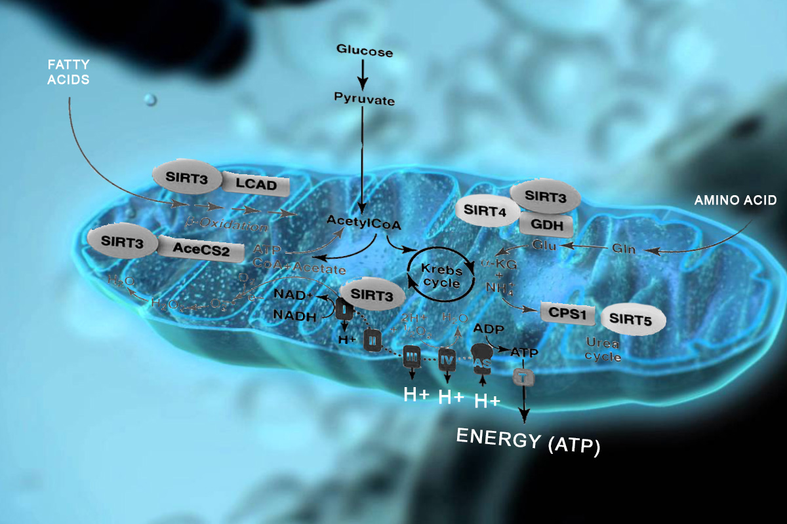

# Electric universe

## CLAIMS

* Einstein's postulates are wrong
* General relativity \(GR\) is wrong
* The Universe is not expanding
* The electric force travels faster than the speed of light with near-infinite velocity
* Gravity has two poles like a bar magnet; dipole gravity
* A plenum of neutrinos forms an all-pervasive aether
* Planets give birth to comets.
* Stars do not shine because of internal nuclear fusion caused by gravitational collapse. Rather, they are anodes for galactic discharge currents.
* Impact craters on Venus, Mars and the Moon are not caused by impacts, but by electrical discharges. The same applies to the massive canyon on Mars and the Grand Canyon on Earth.
* The Sun is negatively charged, and the solar wind is positively charged — the two systems forming a giant capacitor

## VISUALS

