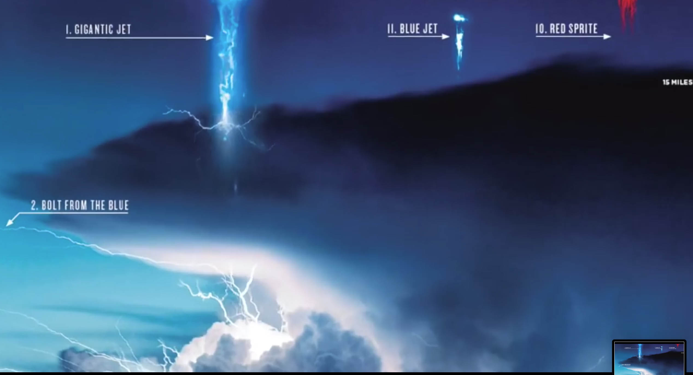
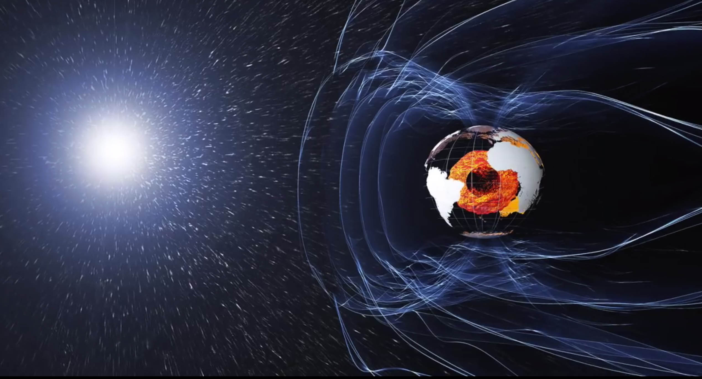
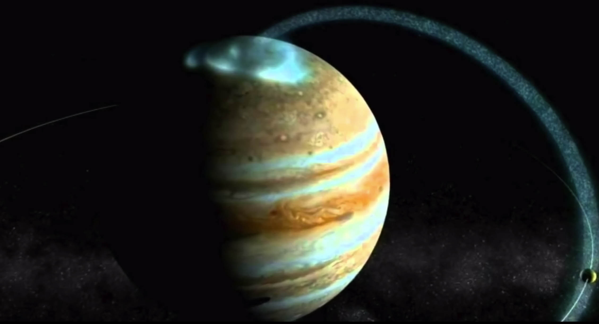

# Electric universe

> From the smallest particle to the largest galactic formation, a web of electrical circuitry connects and unifies all of nature, organizing galaxies, energizing stars, giving birth to planets and, on our own world, controlling weather and animating biological organisms. There are no isolated islands in an electric universe. ~ _Thunderbolts of the Gods_

## CLAIMS

* Einstein's postulates are wrong
* General relativity \(GR\) is wrong
* The Universe is not expanding
* The electric force travels faster than the speed of light with near-infinite velocity
* Gravity has two poles like a bar magnet; dipole gravity
* A plenum of neutrinos forms an all-pervasive aether
* Planets give birth to comets.
* Stars do not shine because they are anodes for galactic discharge currents.
* Impact craters on planets and moons are not caused by impacts, but by electrical discharges.
* The Sun is negatively charged, and the solar wind is positively charged — the two systems forming a giant capacitor

## VISUALS                                                

## VIDEO



## RESOURCES

[https://www.youtube.com/user/ThunderboltsProject](https://www.youtube.com/user/ThunderboltsProject)  
[https://](https://www.youtube.com/user/ThunderboltsProject)[www.thunderbolts.info](www.thunderbolts.info)  
[https://www.nasa.gov/multimedia/imagegallery/index.html](https://www.nasa.gov/multimedia/imagegallery/index.html)  

