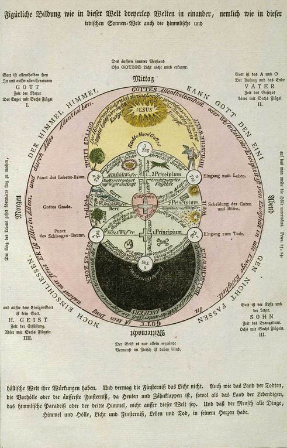
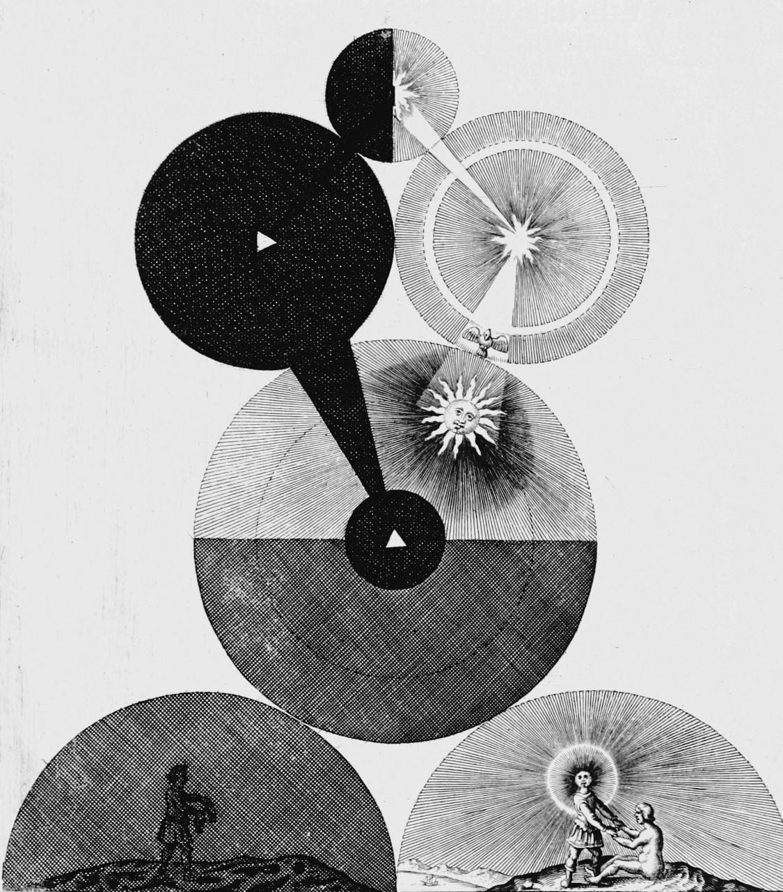

# Hermetics & alchemy

## ALCHEMY

The Western alchemy, as well as the Arabic alchemy, inspired by Hermeticism is known as an occult science dedicated to the transmutation of metals, both of the real ones and of the symbols which they represent. The Great Alchemical Work aims to sublimate matter, to release the soul from the material body, lead being transmuted into gold, transforming the ordinary human being into a superhuman. Alchemy does not work solely with matter, but also with the spirit, the transmutation targeting both domains, it's objectives being _The Philosophical Stone_ and the _Elixir of Life_.

## **HERMETICISM**

Being present since the beginning of the Christian era, it expresses a synthesis in which the Egyptian god Thoth and the Greek god Hermes are overlapped, even merged. Hermes was called _Trismegistos_, Thrice the Great, whereas he possesed three parts from the wisdom of the world: Alchemy, Astrology, Theurgy. Set of Egyptian concepts, Hermeticism is a gnosis whose purpose is the regeneration of the ordinary and profane human by knowledge of his superior reality and the powers that are hidden beyond of his apparent nature.

## ART

## VIDEO



## RESOURCES

[https://medium.com/the-mission/the-hermetic-revival-7-ancient-principles-for-self-mastery-9399e523648d](https://medium.com/the-mission/the-hermetic-revival-7-ancient-principles-for-self-mastery-9399e523648d)

